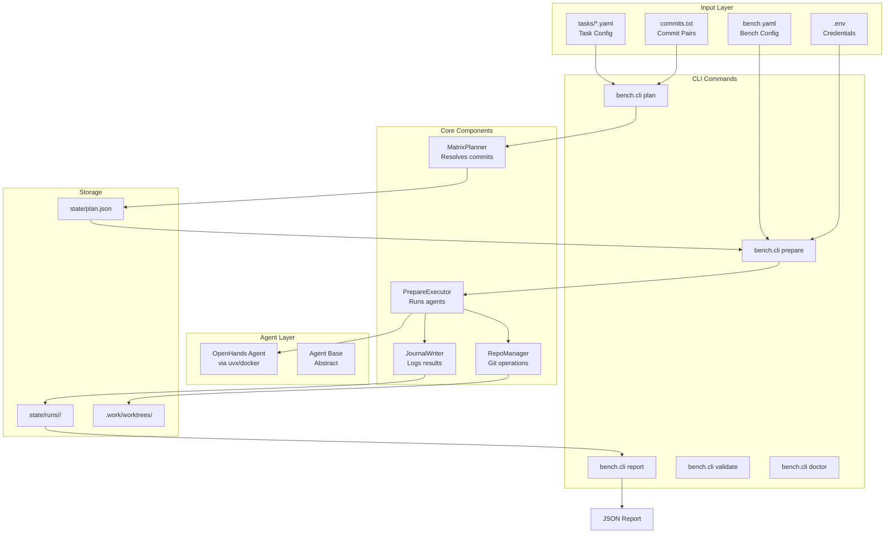
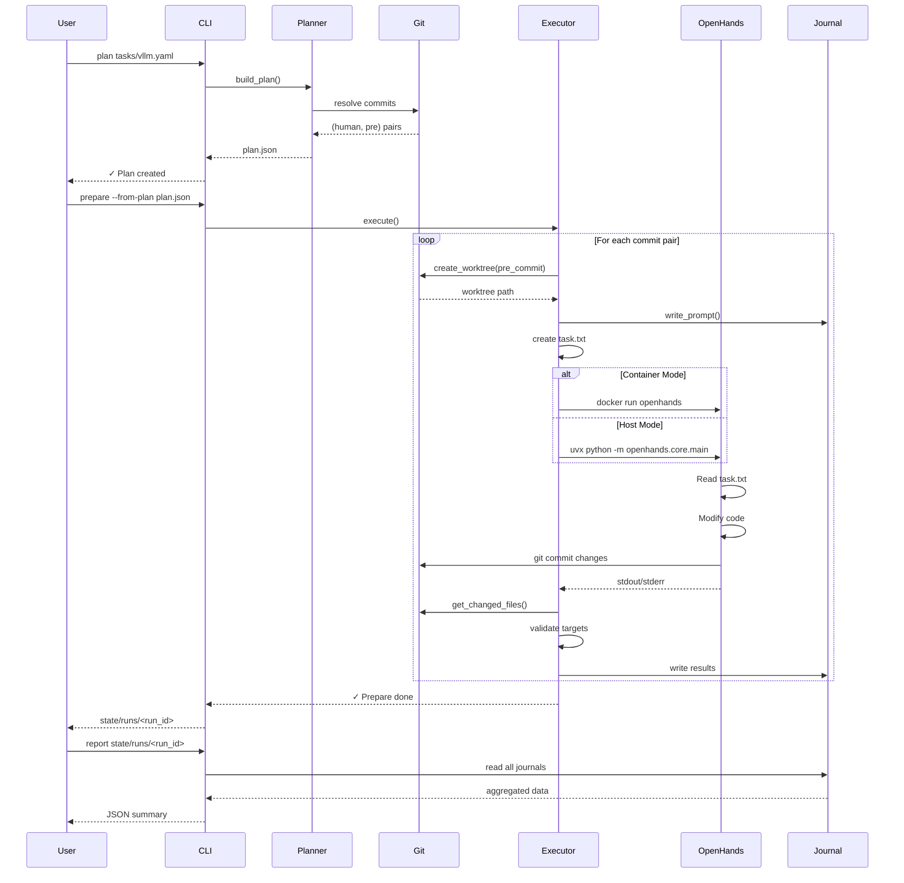
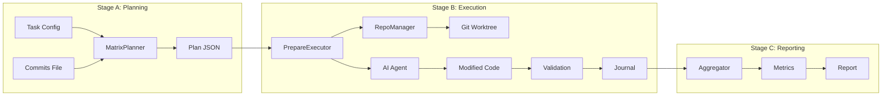
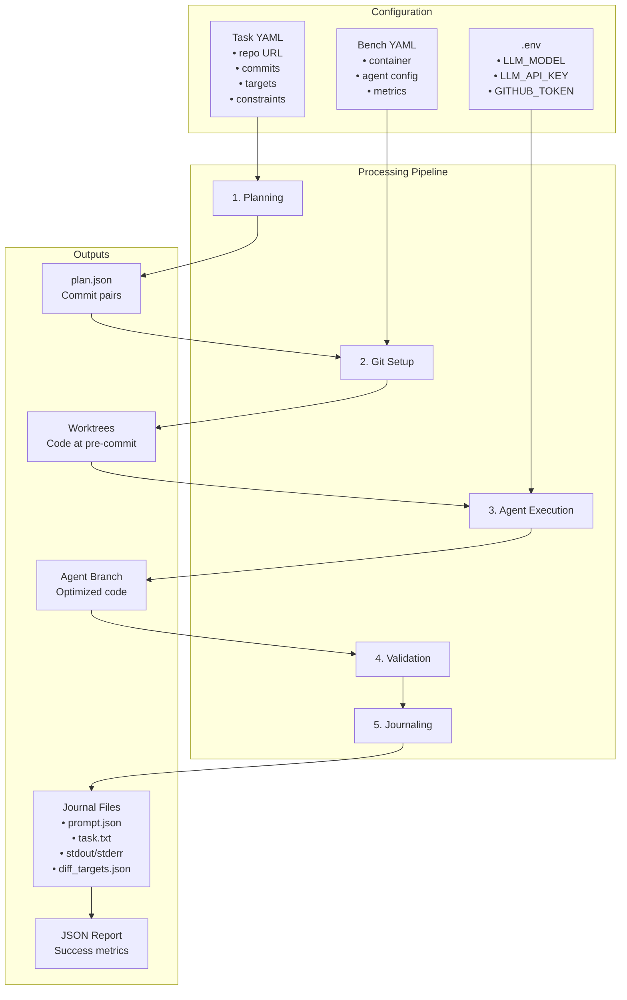
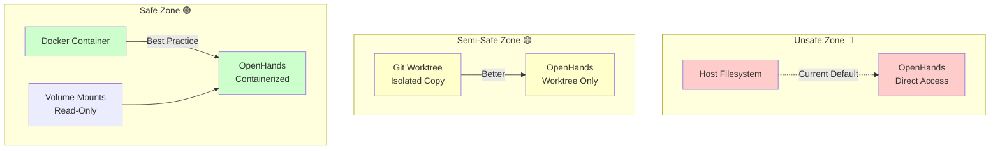

# ISO-Bench Architecture

## System Overview



## Detailed Flow Diagram



## Component Interactions



## Data Flow Architecture



## File System Layout

```
ISO-Bench/
│
├── .env                    # Runtime credentials
├── bench.yaml              # Global configuration
│
├── tasks/                  # Task definitions
│   ├── vllm.yaml
│   └── example.yaml
│
├── .work/                  # Temporary workspace
│   ├── repos/              # Base git clones
│   │   └── <repo_name>/
│   └── worktrees/          # Git worktrees
│       └── <repo>_<hash>/
│
├── state/                  # Execution state
│   ├── plan.json           # Current plan
│   └── runs/               # Run history
│       └── <run_id>/
│           └── <item_id>/
│               ├── task.txt
│               ├── prompt.json
│               ├── journal.json
│               ├── diff_targets.json
│               ├── openhands_stdout.txt
│               └── openhands_stderr.txt
│
└── bench/                  # Source code
    ├── cli.py              # CLI interface
    ├── planner.py          # Commit resolution
    ├── prepare.py          # Agent orchestration
    ├── pipeline.py         # Full pipeline
    ├── repo_manager.py     # Git operations
    ├── journal.py          # Result logging
    ├── agents/
    │   ├── base.py
    │   └── openhands.py
    ├── metrics/
    │   └── builtin/
    └── container/
        └── runtime.py
```

## Security & Isolation Layers



## Key Design Decisions

1. **Git Worktrees**: Isolates each optimization attempt in separate directory
2. **Journal Pattern**: Captures all outputs for reproducibility
3. **Plugin Metrics**: Extensible metric system via registry
4. **Resume Capability**: Can restart interrupted runs
5. **Parallel Execution**: ThreadPoolExecutor for concurrent agent runs

## Current Issues

- **No sandboxing by default**: Agents run with full host access
- **Inconsistent interfaces**: Two OpenHands implementations
- **No rollback mechanism**: Failed runs can't be easily reverted
- **Limited observability**: Minimal real-time progress tracking