# ISO-Bench Architecture

## System Overview


## Detailed Flow Diagram


## Component Interactions


## Data Flow Architecture

```mermaid
graph TB
    subgraph "Configuration"
        TASK[Task YAML<br/>• repo URL<br/>• commits<br/>• targets<br/>• constraints]
        BENCH[Bench YAML<br/>• container<br/>• agent config<br/>• metrics]
        CREDS[.env<br/>• LLM_MODEL<br/>• LLM_API_KEY<br/>• GITHUB_TOKEN]
    end

    subgraph "Processing Pipeline"
        P1[1. Planning]
        P2[2. Git Setup]
        P3[3. Agent Execution]
        P4[4. Validation]
        P5[5. Journaling]
    end

    subgraph "Outputs"
        PLAN2[plan.json<br/>Commit pairs]
        WORK[Worktrees<br/>Code at pre-commit]
        AGENT[Agent Branch<br/>Optimized code]
        JOURNAL[Journal Files<br/>• prompt.json<br/>• task.txt<br/>• stdout/stderr<br/>• diff_targets.json]
        REPORT[JSON Report<br/>Success metrics]
    end

    TASK --> P1
    P1 --> PLAN2
    PLAN2 --> P2
    BENCH --> P2
    P2 --> WORK
    WORK --> P3
    CREDS --> P3
    P3 --> AGENT
    AGENT --> P4
    P4 --> P5
    P5 --> JOURNAL
    JOURNAL --> REPORT
```



## File System Layout

```
ISO-Bench/
│
├── .env                    # Runtime credentials
├── bench.yaml              # Global configuration
│
├── tasks/                  # Task definitions
│   ├── vllm.yaml
│   └── example.yaml
│
├── .work/                  # Temporary workspace
│   ├── repos/              # Base git clones
│   │   └── <repo_name>/
│   └── worktrees/          # Git worktrees
│       └── <repo>_<hash>/
│
├── state/                  # Execution state
│   ├── plan.json           # Current plan
│   └── runs/               # Run history
│       └── <run_id>/
│           └── <item_id>/
│               ├── task.txt
│               ├── prompt.json
│               ├── journal.json
│               ├── diff_targets.json
│               ├── openhands_stdout.txt
│               └── openhands_stderr.txt
│
└── bench/                  # Source code
    ├── cli.py              # CLI interface
    ├── planner.py          # Commit resolution
    ├── prepare.py          # Agent orchestration
    ├── pipeline.py         # Full pipeline
    ├── repo_manager.py     # Git operations
    ├── journal.py          # Result logging
    ├── agents/
    │   ├── base.py
    │   └── openhands.py
    ├── metrics/
    │   └── builtin/
    └── container/
        └── runtime.py
```

## Security & Isolation Layers

```mermaid
graph TB
    subgraph "Unsafe Zone 🔴"
        HOST[Host Filesystem]
        AGENT_HOST[OpenHands<br/>Direct Access]
    end

    subgraph "Semi-Safe Zone 🟡"
        WORKTREE[Git Worktree<br/>Isolated Copy]
        AGENT_WT[OpenHands<br/>Worktree Only]
    end

    subgraph "Safe Zone 🟢"
        CONTAINER[Docker Container]
        AGENT_DOCKER[OpenHands<br/>Containerized]
        VOL[Volume Mounts<br/>Read-Only]
    end

    HOST -.->|Current Default| AGENT_HOST
    WORKTREE -->|Better| AGENT_WT
    CONTAINER -->|Best Practice| AGENT_DOCKER
    VOL --> AGENT_DOCKER

    style HOST fill:#ffcccc
    style AGENT_HOST fill:#ffcccc
    style WORKTREE fill:#ffffcc
    style AGENT_WT fill:#ffffcc
    style CONTAINER fill:#ccffcc
    style AGENT_DOCKER fill:#ccffcc
```



## Key Design Decisions

1. **Git Worktrees**: Isolates each optimization attempt in separate directory
2. **Journal Pattern**: Captures all outputs for reproducibility
3. **Plugin Metrics**: Extensible metric system via registry
4. **Resume Capability**: Can restart interrupted runs
5. **Parallel Execution**: ThreadPoolExecutor for concurrent agent runs

## Current Issues

- **No sandboxing by default**: Agents run with full host access
- **Inconsistent interfaces**: Two OpenHands implementations
- **No rollback mechanism**: Failed runs can't be easily reverted
- **Limited observability**: Minimal real-time progress tracking