## ISO-Bench: Commit-to-Dataset Architecture, Test Generation, and Prompts

### Purpose and Scope

This document is a comprehensive, step-by-step walkthrough of the ISO-Bench pipeline that turns commit extractions into a canonical dataset with embedded performance tests. It covers:

- The end-to-end orchestration from `commit_to_dataset.py`
- Where prompts live, how they are constructed, and how they are saved
- How the LLM generator creates the test-case generator scripts
- How generated tests are materialized and executed (local and docker; CUDA vs CPU timing)
- Dataset schema, outputs, and optional Hugging Face push
- Concrete file paths, example artifacts, operational guidance, and known pitfalls


### Quick Links (Key Files and Directories)

- Driver/orchestration: `commit_to_dataset.py`
- Commit analysis (diff/message/date): `src/collect/analysis/commits.py`
- Prompt template (default): `third-party/effibench/prompts/focused_test_case_generator_prompt.md`
- LLM generator (builds prompt, calls LLM, saves generator): `src/test_scripts/generate_test_generators.py`
- Example pre-generated generators: `misc/experiments/generated_test_generators_v4/*.py`
- Final prompt record (for debugging): `eg_test_generator.txt`
- Extraction JSONs: `misc/experiments/commit_extractions_with_apis/*.json`
- Dataset schema doc: `docs/dataset_schema.md`
- Local dataset outputs: `data/*.jsonl`
- Run configuration: `experiments.yaml`
- Pipeline logs: `commit_to_dataset.log`


### High-Level Flow

1) Read config (YAML): repo path, extraction dir, docker settings, dataset name, HF push options.
2) Discover commits from extraction JSONs (commit hash + parent hash).
3) For each commit:
   - Clone repo to a temp workspace; collect commit metadata and diff.
   - Find or generate a test-case generator script for that commit.
   - Materialize the test into the cloned repo and run it on base/head/main.
   - Assemble a canonical record with the script content and timing arrays.
4) Write dataset to `data/<dataset>.jsonl`; optionally push to HF.


### Sequence Diagram (End-to-end)

```mermaid
sequenceDiagram
  participant U as User/Config
  participant M as commit_to_dataset.py
  participant A as PerfCommitAnalyzer
  participant G as find_or_generate_test_script
  participant P as Prompt Builder
  participant L as LLMClient (OpenAI/Anthropic)
  participant F as Filesystem
  participant R as Test Runner (local/docker)
  participant D as Dataset Writer/HF

  U->>M: Provide experiments.yaml (repo_path, extractions_dir,...)
  M->>M: scan_extraction_files()
  loop For each (head, base)
    M->>A: process_commit(head, repo_path)
    A-->>M: subject, message, date, files, unified diff
    M->>G: find_or_generate_test_script(head, extr_dir, out_dir)
    alt Pre-generated exists
      G-->>M: path to misc/experiments/generated_test_generators_v4/<hash8>_test_case_generator.py
    else Generate via LLM
      G->>P: read extraction JSON; read prompt template
      P->>P: build prompt; write eg_test_generator.txt
      P->>L: send prompt
      L-->>P: raw response (code markdown)
      P->>P: clean + validate + repair code
      P->>F: save <hash8>_test_case_generator.py
      G-->>M: path to saved script
    end
    M->>F: write cloned_repo/_generated_perf_tests/test_generated.py
    par Execute timings
      M->>R: checkout base; run test
      R-->>M: times/base (ms)
      M->>R: checkout head; run test
      R-->>M: times/head (ms)
      M->>R: checkout main; run test
      R-->>M: times/main (ms)
    end
    M->>M: assemble CanonicalRecord(efficiency_test=[script], duration_changes, human_performance,...)
    M->>D: save_and_push(records, dataset_name)
    D-->>M: data/<dataset>.jsonl (optional push_to_hf)
  end
```


### Artifact Lifecycle Diagram

```mermaid
graph LR
  A["Commit extraction JSON\n(misc/experiments/commit_extractions_with_apis/*.json)"] --> B["Prompt Builder\n(src/test_scripts/generate_test_generators.py)"]
  B --> C["Prompt Template\n(third-party/effibench/prompts/focused_test_case_generator_prompt.md)"]
  B --> D["Final Prompt w/ JSON\neg_test_generator.txt"]
  D --> E["LLMClient.generate()\n(OpenAI/Anthropic)"]
  E --> F["Clean/Validate/Repair Code"]
  F --> G["Save Generator Script\n(misc/experiments/generated_test_generators_v4/<hash8>_test_case_generator.py)"]
  G --> H["Materialize Test into Repo\n(_generated_perf_tests/test_generated.py)"]
  H --> I{Run at Commits}
  I -->|base| J["Timing (ms)"]
  I -->|head| K["Timing (ms)"]
  I -->|main| L["Timing (ms)"]
  J --> M
  K --> M
  L --> M
  M["CanonicalRecord\n(efficiency_test, duration_changes, ...)"] --> N["Write data/<dataset>.jsonl"]
  N --> O{push_to_hf?}
  O -->|Yes| P["datasets.push_to_hub(split=test)"]
```




## Detailed Walkthrough

### Configuration (YAML)

Path: `experiments.yaml`

```yaml
# ISO-Bench commit-to-dataset configuration (BATCH MODE)
repo_path: "/root/ISO-Bench/vllm"
extractions_dir: "/root/ISO-Bench/misc/experiments/commit_extractions_with_apis"
use_docker: false
docker_image: "anonymous/vllm-bench:latest"
dataset_name: vllm_dataset_with_test
hf_repo: https://huggingface.co/ISO-Bench
push_to_hf: false
setup_commands: []
install_commands: []
api: null
notes: null
```

- `repo_path`: The repo to clone and run tests against.
- `extractions_dir`: Directory of per-commit extraction JSONs (each names a `commit_hash` and its `parent_hash`).
- `use_docker`/`docker_image`: Run tests in a GPU-enabled container.
- `dataset_name`, `hf_repo`, `push_to_hf`: Output dataset naming and optional push.


### Orchestration: `commit_to_dataset.py`

Major responsibilities:

- Load config; scan extraction files (`scan_extraction_files`) and collect `(head_commit, base_commit)` tuples.
- For each tuple, call `assemble_canonical(...)` to:
  - Clone repo to a temp workspace.
  - Extract commit metadata and diffs using `PerfCommitAnalyzer.process_commit` (from `src/collect/analysis/commits.py`).
  - Find or generate a test-case generator: `find_or_generate_test_script(head_commit, extr_dir, out_dir)`.
  - Write the resulting test code into `_generated_perf_tests/test_generated.py` inside the cloned repo.
  - Run the test for base/head/main and collect timing arrays.
  - Create a `CanonicalRecord` with `efficiency_test=[full_script_text]`, `duration_changes`, `human_performance`, and metadata.
- Finally, `save_and_push(records, out_dir, dataset_name, push_to_hf, hf_repo_id)` writes `data/<dataset>.jsonl` and optionally pushes to HF.


### Commit Metadata and Diff: `PerfCommitAnalyzer`

Path: `src/collect/analysis/commits.py`

- `PerfCommitAnalyzer.process_commit(commit_hash, repo_path, max_year=None)` returns:
  - `subject`, `message`, `date`
  - `files_changed`
  - `diff_text` (unified diff; fallback to `git diff -p old^ new`)
- Additional LLM-based filtering and API identification prompts live here, but the dataset pipeline primarily uses `process_commit` to capture the diff and message.


### Test Script Resolution: Pre-generated vs LLM Generation

Function: `find_or_generate_test_script(head_commit, extractions_dir, out_dir)` in `commit_to_dataset.py`.

1) Pre-generated path: If a matching generator exists at
   - `misc/experiments/generated_test_generators_v4/<full_hash>_test_case_generator.py` or
   - `misc/experiments/generated_test_generators_v4/<hash8>_test_case_generator.py`
   it is used directly.

2) LLM generation path: Otherwise it calls `src/test_scripts/generate_test_generators.py` to synthesize a generator script on-the-fly.


### Prompt Template and How the Prompt is Built

- Default template path: `third-party/effibench/prompts/focused_test_case_generator_prompt.md`
- This template instructs the model to produce a single, focused, realistic performance test with:
  - `setup`, `experiment`, `store_result`, `load_result`, `check_equivalence`, `run_test`
  - Strong requirements around realistic workloads, non-hackable inputs, CUDA timing if available, and equivalence checking.

Builder: `src/test_scripts/generate_test_generators.py`

- Loads the template (env override: `TEST_CASE_GENERATOR_PROMPT`).
- Reads the entire extraction JSON text for the commit.
- Constructs the final prompt by appending the JSON in a fenced block after the template.
- Writes the exact prompt to `eg_test_generator.txt` for transparency.


### LLM Client, Regeneration, and Repair

Path: `src/test_scripts/generate_test_generators.py`

- `LLMClient` selects provider based on env keys:
  - OpenAI if `OPENAI_API_KEY` present; else Anthropic if `ANTHROPIC_API_KEY` present.
  - Model name is configurable; the code has a placeholder default.
- Response handling:
  - Extract Python code from markdown fences or raw text.
  - Validate with `ast.parse`.
  - If code is empty/trivial, attempt up to two regenerations.
  - If still invalid, perform up to two “repair” passes with a prompt that includes the compiler error.
  - On success, save to `misc/experiments/generated_test_generators_v4/<hash8>_test_case_generator.py` and return the path.
- If no valid `script_path` is produced after attempts, the pipeline logs an error and moves on to the next commit.

Observed failure mode (from `commit_to_dataset.log`): sometimes the LLM returns content that fails nontriviality/syntax checks, leading to `result: None` and skipping that commit for generation.


### What the Generated Test Script Looks Like

Example (truncated) of a pre-generated script used by the pipeline:

```python
# File: misc/experiments/generated_test_generators_v4/0f40557a_test_case_generator.py
import argparse
import timeit
import random
from typing import Dict, Any, List
from unittest.mock import patch, MagicMock

import pytest
import torch
import numpy as np

# Try importing heavy modules (skip if unavailable)
try:
    import cacheflow.cache_ops as cache_ops
    from cacheflow.worker.cache_engine import CacheEngine
    from cacheflow.models.sample import _sample_from_generation_tokens
    import benchmark.benchmark_latency as benchmark_latency
except Exception as e:
    cache_ops = None
    CacheEngine = None
    _sample_from_generation_tokens = None
    benchmark_latency = None
    _import_error = e

def setup_workload(...):
    ...  # realistic tensors, seeds, shapes

@pytest.mark.skipif(...)
def test_copy_blocks_kernel_basic():
    ...  # correctness vs reference baseline

def test_copy_blocks_performance_regression():
    ...  # timeit baseline vs optimized kernel, 20% tolerance

def test_benchmark_latency_sampling_params_construction():
    ...  # test expected SamplingParams construction

def test_backward_compatibility_sample_api():
    ...
```

Common patterns:
- Realistic workloads with seeded randomness; devices selected based on `torch.cuda.is_available()`.
- Correctness assertions comparing optimized results to a reference baseline.
- Performance checks using `timeit` or CUDA-event measurements.
- Graceful skips if C++/CUDA extensions or modules aren’t available in the environment.


### Materializing and Running the Test

Once a generator path is resolved, `commit_to_dataset.py`:

- Reads the generator’s code as text and writes it to the cloned repo at:
  - `CLONE/_generated_perf_tests/test_generated.py`

- Runs it 3 times (base/head/main). Per-revision execution uses one of:
  - Local mode (`run_tests_locally`):
    - CUDA available: `torch.cuda.Event` timing around a subprocess invocation of the script.
    - CPU only: wall-clock timing around the subprocess.
  - Docker mode (`run_tests_in_docker`): same idea, but via `docker run --gpus all` in the configured image.

- Captures timing arrays and computes `human_performance = mean(base)/mean(head)`.


### Canonical Dataset Record and Output

`docs/dataset_schema.md` defines the canonical schema (v1). Key fields:

- Identity: `repo`, `instance_id`, `created_at`
- Code change: `base_commit`, `head_commit`, `patch`, `test_patch`
- Tests and prompts: `efficiency_test` (array of strings with the test code)
- Timing: `duration_changes` (arrays for base/head), `human_performance`
- Environment: `version` and optional setup/install commands

Records are written to `data/<dataset>.jsonl`. Optional: push to Hub using `datasets.push_to_hub(split="test")` with dedup by `(repo, head_commit)`.


## Operational Guide

### Prerequisites

- Python environment satisfying `requirements.txt`.
- For on-the-fly generation: set at least one of `OPENAI_API_KEY` or `ANTHROPIC_API_KEY`.
- Optional: Docker and NVIDIA container runtime for GPU docker runs.

### Running the Pipeline

```bash
PYTHONPATH=src python commit_to_dataset.py experiments.yaml
```

What you’ll see:

- Log file at `commit_to_dataset.log` detailing each commit, generator resolution, script sizes, and errors.
- If generation is needed, `eg_test_generator.txt` will contain the full prompt sent to the LLM.
- Output dataset at `data/<dataset>.jsonl` (unless no commits succeeded).


### Customizing the Prompt

- To override the default template, set:

```bash
export TEST_CASE_GENERATOR_PROMPT=/absolute/path/to/your_template.md
```

- You can author templates tailored to specific repos (e.g., preamble with domain-specific imports and examples), but keep the required function signatures.


### Seeding with Pre-generated Scripts

- Place your own generator as:
  - `misc/experiments/generated_test_generators_v4/<hash8>_test_case_generator.py`
- The pipeline will pick that over LLM generation. Useful for flaky commits or hardware-heavy scenarios.


### Tips to Reduce LLM Failures

- Use a robust model and keep temperatures low.
- Add a minimal skeleton requirement in the template (already present) and include 1–2 tiny examples.
- If many commits are CI/config-only, consider filtering extractions before attempting generation.


## Known Pitfalls and Observed Behavior

- If no GPU/CUDA is available, scripts will often skip heavy tests gracefully; performance signals may be weaker or limited.
- LLM may fail to output nontrivial or syntactically valid code even after retries; the pipeline logs and continues.
- Some repos require custom setup/installs which are not executed by default; add `setup_commands`/`install_commands` to the YAML for record-keeping.


## Appendix: Example Artifacts

### Example: Final Prompt (Truncated for Brevity)

Path: `eg_test_generator.txt`

```text
# Performance Test Script Generator Prompt
...
<!-- Commit: 3127e975fb9417d10513e25b80820870f594c627 -->
Here is the commit extraction JSON you must base the tests on:

```json
{ "commit_hash": "3127e975fb9...", "parent_hash": "4001ea...", ... }
```
```


### Example: Log Evidence (Truncated)

Path: `commit_to_dataset.log`

```text
... Using pre-generated test generator: misc/experiments/generated_test_generators_v4/0f40557a_test_case_generator.py
... Generated efficiency_test script: chars=19595; lines=431
... process_extraction_file result: None
ERROR - LLM generation did not return a valid script_path.
```


---

If you have questions or want to extend the pipeline (e.g., multi-test generation, richer environment capture, or strict schema validation), consider starting in `commit_to_dataset.py` and `src/test_scripts/generate_test_generators.py`.


